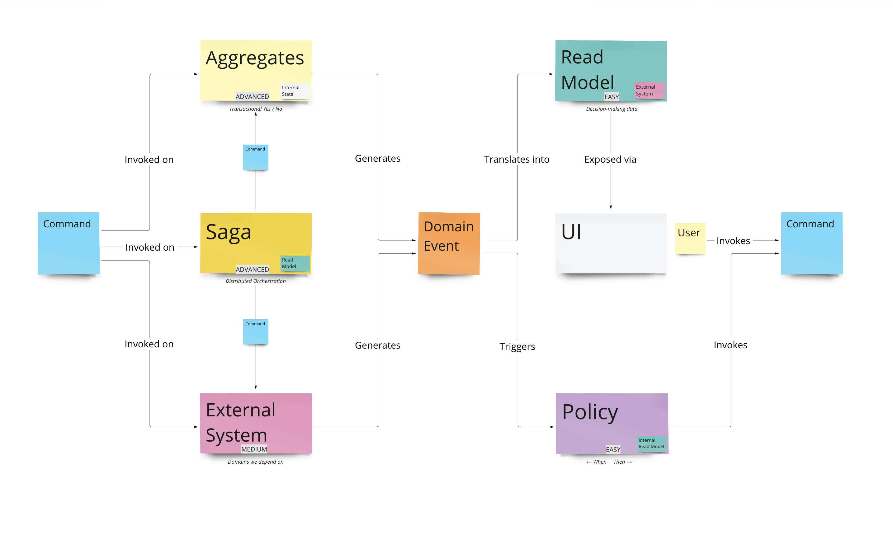

# 🚀 The Domain Development Kit (DDK)

_An Event-Storm to Event-Sourced application framework_

Welcome to The Domain Development Kit (DDK), a robust and comprehensive application framework designed to take you from collaborative Event Storming sessions to an Event-Sourced application seamlessly. This is a framework for developers looking to build complex systems with a strong emphasis on separating concerns and focusing on the business logic.

The key feature of the DDK is allowing you to build an application using the building blocks shown in this diagram:

- Commands
- Aggregates
- Sagas
- External Systems (In/Out)
- Events
- Read Models
- Policies

Once you learn how to use these building blocks, you can build (almost) any backend you can imagine.

This framework has been used to build a number of applications for enterprise clients at our sister comapny [Xolvio](https://www.xolv.io), and we're excited to share it with the world as the open-source counterpart to our cloud offering at [XSpecs.ai](https://www.xspecs.ai).

_(XSpecs istslef is built using the DDK!)_

## 🌟 Features

- **Event Sourcing and CQRS**: DDK encapsulates the complexity of implementing an Event-Sourcing architecture and Command Query Responsibility Segregation (CQRS) in your applications.
- **Decorator-based Command and Event Handlers**: Easily register and handle commands and events using a declarative and intuitive decorator-based approach.
- **Read Model Management**: DDK manages Read Models and their handlers, ensuring efficient handling of domain-specific views of your data.
- **Serialization**: DDK comes with a built-in Serializer class that allows developers to serialize and deserialize domain events into a form that can be stored and retrieved.

## 🔑 Key Components

- **Command**: An object that represents a single instruction to the system.
- **Event**: Represents something that has occurred in the system.
- **AggregateRoot**: An entity that is used to enforce business rules before new Events are emitted.
- **Repository**: Used to retrieve Aggregates from an EventStore and save newly applied events.
- **EventStore**: An interface representing a mechanism to store and retrieve events.
- **ReadModel**: Represents a read-only projection of your data.
- **Registry**: A singleton class that manages the registration and retrieval of command handlers, event handlers, and read model handlers.

## 📚 Documentation

More detailed documentation about specific modules, usage examples, and advanced features can be found in the documentation (coming soon).

## 🚀 Getting Started on DDK development

_For building apps using the DDK please refer to our documentation_

1. Clone the repository.
2. Install dependencies with `yarn install`.
3. Run `yarn test` to ensure everything is set up correctly.
4. Dive into the source code, starting with examples provided to get a feel for how to utilize DDK in your application.

## 🧪 Tests

The DDK includes a comprehensive suite of tests to ensure its reliability and accuracy. To run these tests, use the command `yarn test`.

## 🤝 Contributions

Contributions are always welcome! Feel free to open issues and pull requests. We aim to create a robust and reliable tool for everyone to use and improve.

We have a very high bar for automated testing set at a 100% coverage threshold. If you find we've somehow missed any tests, please open an issue, and we'll get it fixed as soon as possible.

📖 "Code is read much more often than it is written, so plan accordingly." - Anonymous
