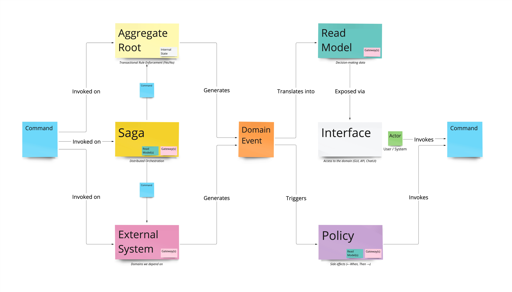

# 🚀 The Narrative Development Kit (NDK)

_A Narrative Script to Event-Sourced application library_

Welcome to The Narrative Development Kit (NDK), a lightweight application library (not framework) designed to take you from visual collaborative Narrative Scripting sessions to an Event-Sourced application seamlessly. This is a library for developers looking to build complex systems with a strong emphasis on separating concerns and focusing on the business logic.

The key feature of the NDK is allowing you to build an application using the building blocks shown in this diagram:

- Commands
- Aggregates
- Sagas
- External Systems (In/Out)
- Events
- Read Models
- Policies

Once you learn how to use these building blocks, you can build (almost) any backend you can imagine.

Some versions of this library has been used to build a number of applications for enterprise clients at [Xolvio](https://www.xolv.io), and we're excited to share it with the world as the open-source counterpart to our sister company cloud offering at [Narrative.tech](https://www.narrative.tech).

## 🤔 What is Narrative.tech?

Narrative + NDK = Pure Joy. Narrative provides you with a single source of truth for all your requirments, and get this: You can go from Narrative Script diagrams to a fully working application in a matter of hours. We've done it, and it's a beautiful thing!

Using the modeler in Narrative, you can create a visual representation of your domain model. Narrative will then generate the all the scaffolding for you to use with the NDK to build your application.

Along with the boilerplate, Narrative also does a first pass at coding your business logic, as well as tests using AI. The result is a massive time saving that allows you to focus on decoding complex domains into artful solutions, rather than being a syntax warrior.

All changes are synced bi-directionally, so you can make changes in Narrative and have them reflected in your code, and vice versa. You can think of the Narrative Scripts as a sort of visual code editor.

Narative can also visualize any code you write using the NDK using the palette above. This is a great way to get your whole team – business and technical alike – on the same page, and to make sure your code is always in sync with your business requirements.

Oh btw, Narrative itself is built using the NDK! 🐶 🥣️

[You can sign up for the beta at the Narrative website](https://www.narrative.tech).

## 🌟 Features

- **Event Sourcing and CQRS**: NDK encapsulates the complexity of implementing an Event-Sourcing architecture and Command Query Responsibility Segregation (CQRS) in your applications.
- **Decorator-based Command and Event Handlers**: Easily register and handle commands and events using a declarative and intuitive decorator-based approach.
- **Read Model Management**: NDK manages Read Models and their handlers, ensuring efficient handling of domain-specific views of your data.
- **Serialization**: NDK comes with a built-in Serializer class that allows developers to serialize and deserialize domain events into a form that can be stored and retrieved.

## 🔑 Key Components

- **Command**: An object that represents a single instruction to the system.
- **Event**: Represents something that has occurred in the system.
- **AggregateRoot**: An entity that is used to enforce business rules before new Events are emitted.
- **Repository**: Used to retrieve Aggregates from an EventStore and save newly applied events.
- **EventStore**: An interface representing a mechanism to store and retrieve events.
- **ReadModel**: Represents a read-only projection of your data.
- **Registry**: A singleton class that manages the registration and retrieval of command handlers, event handlers, and read model handlers.

## 📚 Documentation

More detailed documentation about specific modules, usage examples, and advanced features can be found in the documentation (coming soon).

## 🚀 Getting Started on NDK development

_For building apps using the NDK please refer to our documentation_

1. Clone the repository.
2. Install dependencies with `yarn install`.
3. Run `yarn test` to ensure everything is set up correctly.
4. Dive into the source code, starting with examples provided to get a feel for how to utilize NDK in your application.

## 🧪 Tests

The NDK includes a comprehensive suite of tests to ensure its reliability and accuracy. To run these tests, use the command `yarn test`.

## 🤝 Contributions

Contributions are always welcome! Feel free to open issues and pull requests. We aim to create a robust and reliable tool for everyone to use and improve.

We have a very high bar for automated testing set at a 100% coverage threshold. If you find we've somehow missed any tests, please open an issue, and we'll get it fixed as soon as possible.

Please make sure you are familiar with:

- Writing [good commit messages](https://twitter.com/dmokafa/status/1351152452179996682)
- Keeping the [commit history clean and tidy](https://www.eficode.com/blog/keep-your-git-commits-clean)
- [Commitizen](https://commitizen-tools.github.io/commitizen/)
- [Semantic Release](https://semantic-release.gitbook.io/semantic-release/)

📖 "Code is read much more often than it is written, so plan accordingly." - Anonymous
